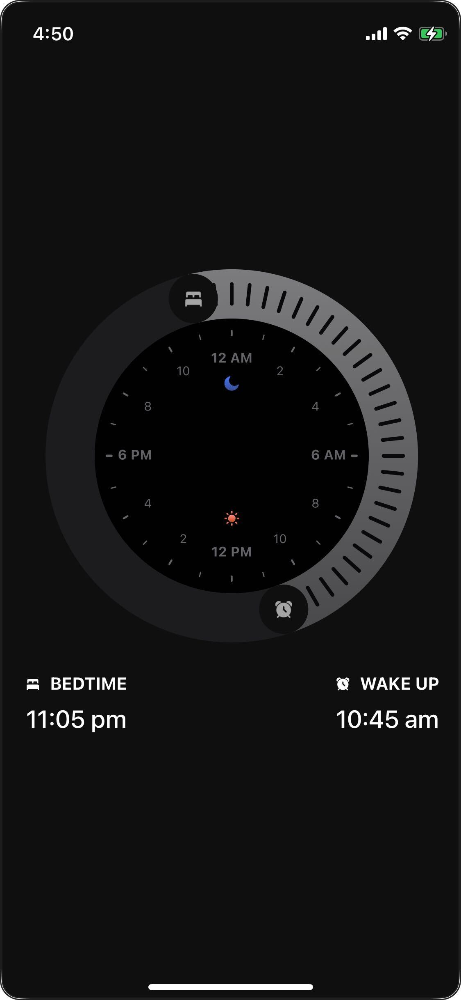

# React Native Apple UI Clock

A React Native package providing Apple-style clock and alarm components with beautiful animations and gestures.

## Preview



*Apple-style bedtime and alarm clock interface with smooth animations and gesture controls*

## Installation

```bash
npm install react-native-apple-ui-clock
```

### Peer Dependencies

Make sure you have these peer dependencies installed:

```bash
npm install react-native-reanimated react-native-gesture-handler react-native-svg expo-haptics
```

## Usage

### Basic Bedtime Component

```tsx
import React, { useState } from 'react';
import { View } from 'react-native';
import { Bedtime } from 'react-native-apple-ui-clock';

export default function App() {
  const [bedTime, setBedTime] = useState("10:00 pm");
  const [alarmTime, setAlarmTime] = useState("7:00 am");

  return (
    <View style={{ flex: 1, justifyContent: 'center', alignItems: 'center' }}>
      <Bedtime 
        bedTimeSet={setBedTime} 
        alarmTimeSet={setAlarmTime} 
        actualBedTime={bedTime} 
        actualAlarmTime={alarmTime} 
      />
    </View>
  );
}
```

### Individual Components

```tsx
import { CircularSlider, TimeText, Container } from 'react-native-apple-ui-clock';

// Use individual components for custom layouts
```

## Available Components

### Main Components

- **`Bedtime`** - Main bedtime/alarm clock interface
- **`CircularSlider`** - Circular time picker with gestures
- **`TimeText`** - Formatted time display component
- **`Cursor`** - Animated cursor for the circular slider
- **`CursorOverlay`** - Overlay component for cursor interactions
- **`Gesture`** - Gesture handling component

### Sub-components

- **`Container`** - Wrapper container with styling
- **`Label`** - Text label component
- **`Quadrant`** - Quadrant-based layout component

### Constants and Utilities

The package also exports useful constants and utility functions used internally.

## Props

### Bedtime Component Props

| Prop | Type | Description |
|------|------|-------------|
| `bedTimeSet` | `(time: string) => void` | Callback when bedtime is set |
| `alarmTimeSet` | `(time: string) => void` | Callback when alarm time is set |
| `actualBedTime` | `string` | Current bedtime value |
| `actualAlarmTime` | `string` | Current alarm time value |

## Requirements

- React Native 0.70+
- React 18+
- Expo SDK 49+ (if using Expo)

## Features

- 🎨 Apple-style design and animations
- 👆 Intuitive gesture controls
- 📱 iOS and Android compatible
- ⚡ Smooth 60fps animations with Reanimated 3
- 🎯 TypeScript support
- 🔧 Customizable components

## Contributing

Issues and pull requests are welcome!

## License

MIT
